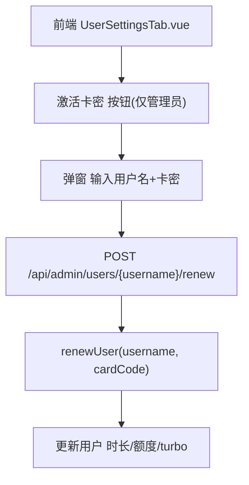

# 管理员激活卡密

Feature Name: admin-activate-card
Updated: 2026-08-16

## Description

在设置 → 用户管理界面（`UserSettingsTab.vue`）的"用户管理"标题旁新增"激活卡密"按钮（仅管理员可见）。管理员点击后输入用户名与卡密，为指定用户激活卡密：延长有效期（time 卡）、增加账号额度（quota 卡）或激活极速务农权限（turbo 卡）。

后端复用现有卡密续费链路 `renewUser(username, cardCode)` 与 `POST /api/admin/users/:username/renew`（`admin-user-routes.js`），不新增后端逻辑，仅在前端提供入口。

## Architecture

## Components and Interfaces

### 后端

复用现有接口（`core/src/controllers/admin-user-routes.js:188`）：

- `POST /api/admin/users/:username/renew`（`requireAdminToken` + `requireAdminRole` + danger confirmation `RENEW_USER`）
  - body: `{ cardCode, confirmed: true }`
  - 成功返回 `{ ok: true, data: { card, accountLimit, cardType, turbo } }`
  - 失败返回对应错误（卡密不存在/禁用/已使用/用户不存在）

### 前端

- **`web/src/components/settings/UserSettingsTab.vue`**
  - 在"用户管理"标题行新增"激活卡密"按钮（新增 `isAdmin` prop 控制显示）。
  - 新增弹窗：用户名输入、卡密输入、取消/确认。
  - 新增 emit `activateCard`，表单状态用 `defineModel` 传递。
- **`web/src/views/Settings.vue`**
  - 向 `UserSettingsTab` 传入 `isAdmin`（来自 `userStore.isAdmin`）。
  - 处理 `activate-card` 事件，调用 `userStore.renewUser(username, cardCode, { confirmed: true })`，成功后提示并刷新。
- **`web/src/stores/user.ts`** — 复用现有 `renewUser(username, cardCode, payload)`（line 301）。

## Data Models

无新增数据模型，复用现有用户 `card` / `accountLimit` / `turbo` 结构。

## Correctness Properties

- 仅管理员/超级管理员可见按钮、可调用接口（后端 `requireAdminRole` 兜底）。
- 卡密一经使用即标记 `usedBy`，同一卡密不可重复激活。
- 激活成功需刷新当前会话与用户列表数据。

## Error Handling

- 表单未填写用户名或卡密：前端提示"请填写用户名与卡密"。
- 卡密不存在/禁用/已使用/用户不存在：透传后端错误消息。
- 非管理员访问接口：后端返回 403。

## Test Strategy

- 单元测试：`renewUser` 各卡密类型的既有测试覆盖（不新增）。
- 集成测试：管理员调用 `/api/admin/users/:username/renew` 激活 time/quota/turbo 卡成功与失败分支。
- 前端：按钮仅管理员可见；提交成功/失败提示。

## References

[^1]: (core/src/controllers/admin-user-routes.js) - 管理员续费接口
[^2]: (core/src/models/user-store.js) - renewUser 实现
[^3]: (web/src/components/settings/UserSettingsTab.vue) - 用户管理界面
[^4]: (web/src/stores/user.ts) - renewUser 前端方法
