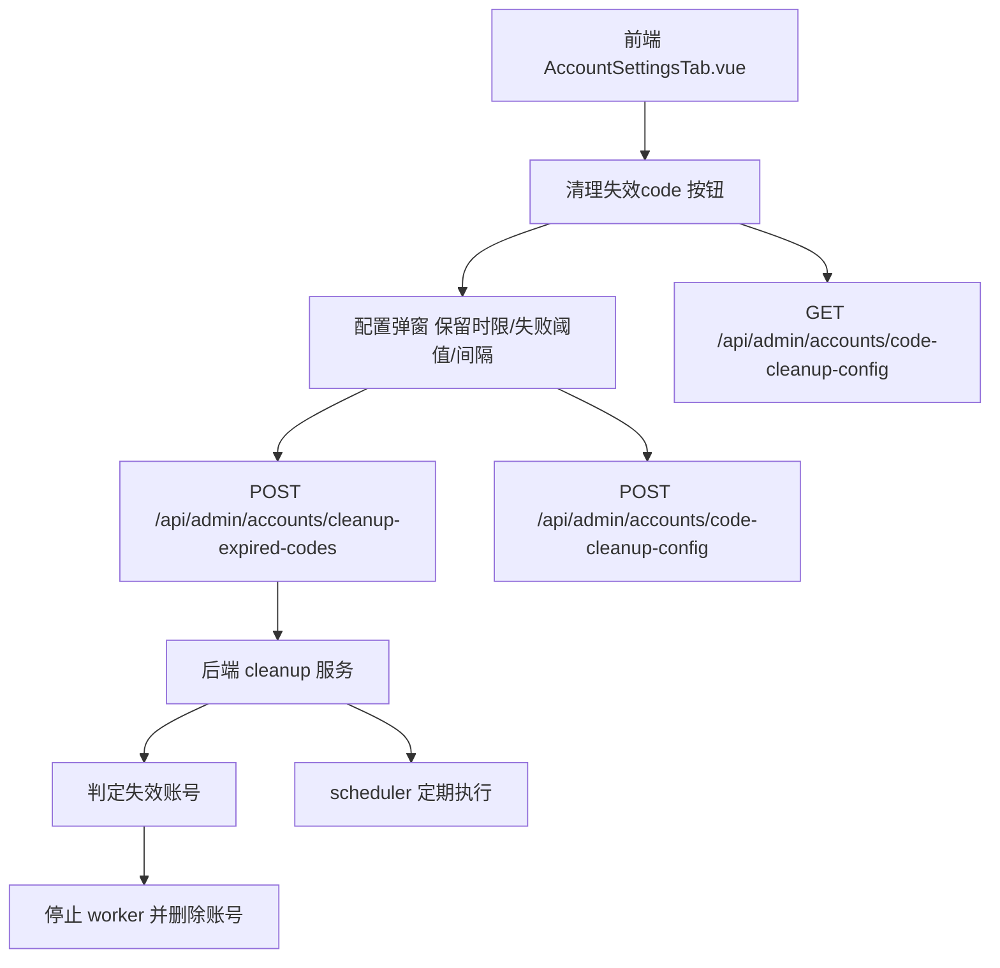

# 失效 code 定期清理

Feature Name: expired-code-periodic-cleanup
Updated: 2026-08-16

## Description

在设置 → 账号管理界面的"一键清理"旁新增"清理失效 code"按钮（仅管理员可见），管理员可配置**保留时限**（默认 7 天）、**连续失败阈值**（默认 3 次）与**自动清理间隔**（默认关闭）。系统据此定期清理微信自动刷新 code 失效的账号，并支持手动立即执行。

判定失效的账号指满足任一条件的账号：存在 `wxid` 且（`code` 为空、距最近一次成功刷新超过保留时限、连续刷新失败次数超过阈值）；或**无微信刷新标识且 worker 当前未运行**的 QQ 端账号。清理动作先停止对应 worker 再删除账号。

## Architecture



## Components and Interfaces

### 后端

- **`core/src/controllers/admin-account-routes.js`**
  - `GET /api/admin/accounts/code-cleanup-config`（`requireAdminToken` + admin）— 返回 `{ retainDays, failThreshold, intervalHours, enabled, lastRunAt, lastCleanupCount }`。
  - `POST /api/admin/accounts/code-cleanup-config`（admin + danger confirmation `UPDATE_CODE_CLEANUP_CONFIG`）— 保存配置，按新间隔重建定时任务。
  - `POST /api/admin/accounts/cleanup-expired-codes`（admin + danger confirmation `CLEAN_EXPIRED_CODES`）— 立即执行一次清理，返回 `{ deletedCount, deletedIds }`。
- **新增 `core/src/runtime/expired-code-cleaner.js`**
  - `createExpiredCodeCleaner({ store, provider, logger, scheduler })`，提供 `runCleanup()`、`reschedule(config)`、`getConfig()`。
  - 判定逻辑：遍历 `provider.getAccounts().accounts`，通过 `hasWxRefreshIdentity(account)`（`wxid`/`openId`/`yybOpenid` 任一非空）区分端别：
    - 微信端：`wxid` 非空且满足任一条件 —— `code` 为空、`codeRefreshFailCount >= failThreshold`（字段缺失视为 0）、`lastCodeRefreshAt` 距当前时间超过 `retainDays` 天（字段缺失且 code 非空视为未超时）。
    - QQ 端（无微信刷新标识）：`provider.isAccountRunning(id)` 为 false 即纳入清理；未注入 `isAccountRunning` 时跳过（安全兜底）。
  - 清理：对每个目标账号先 `provider.stopWorker`（若运行中），再 `store.deleteAccount(id)`，记录 `addAccountLog`。
- **`core/src/runtime/runtime-engine.js`**
  - cleaner 的 provider 注入 `isAccountRunning: (id) => !!(id && workers[id])`，用于判断 QQ 端账号是否已停止。
- **`core/src/runtime/auto-code-refresh.js`**
  - `refreshAccountCode` 成功时更新账号 `lastCodeRefreshAt = Date.now()`、`codeRefreshFailCount = 0`。
  - 失败时递增 `codeRefreshFailCount`（字段缺失按 0 起算）。
- **定时任务**：使用 `createScheduler('expired_code_cleanup')`，配置 `enabled` 且 `intervalHours > 0` 时 `setIntervalTask`；配置变更或账号变更时重建。

### 前端

- **`web/src/components/settings/AccountSettingsTab.vue`**
  - 在"一键清理"按钮旁新增"清理失效 code"按钮（仅管理员，通过 props 传入 `userIsAdmin` 判断）。
  - 点击后打开配置/执行弹窗：展示保留时限、连续失败阈值、自动清理间隔输入框，及"立即清理"按钮。
- **`web/src/composables/settings/useAccountSettings.ts`**
  - 新增 `loadCodeCleanupConfig()`、`saveCodeCleanupConfig()`、`runExpiredCodeCleanup()` 方法。

## Data Models

账号记录新增字段（`store.js addOrUpdateAccount` 已支持透传额外字段）：

```js
{
  id: "1",
  code: "",
  wxid: "wx_xxx",
  lastCodeRefreshAt: 1755360000000,   // 最近一次成功刷新时间戳，可缺省
  codeRefreshFailCount: 0              // 连续刷新失败次数，可缺省
}
```

清理配置存储于 `store` 的 globalConfig 扩展字段：

```js
{
  codeCleanup: {
    enabled: false,
    retainDays: 7,
    failThreshold: 3,
    intervalHours: 0       // 0 表示不自动定期执行
  }
}
```

## Correctness Properties

- 无微信刷新标识的账号仅在已停止运行时纳入清理，运行中的账号绝不清理。
- 正在运行的账号清理前必须先停止 worker，避免删除后残留进程。
- 配置变更后旧定时任务必须清除并按新间隔重建。
- 删除操作不可恢复，须经 danger confirmation（`confirmed: true`）才执行。

## Error Handling

- 配置校验：`retainDays` 与 `failThreshold` 必须为正整数，`intervalHours` 为非负整数。
- 清理过程中单账号失败（停止 worker 失败）不中断整体流程，跳过该账号并记录日志。
- 接口未授权返回 401/403，配置非法返回 400。

## Test Strategy

- 单元测试：失效判定逻辑（空 code / 超过保留时限 / 超过失败阈值 / 微信端正常排除）。
- 单元测试：QQ 端账号已停止纳入清理、运行中不清理、未注入 `isAccountRunning` 时跳过。
- 单元测试：`refreshAccountCode` 成功/失败更新字段。
- 集成测试：手动清理接口删除目标账号并保留非目标账号。
- 前端：按钮仅管理员可见；确认弹窗与结果提示。

## References

[^1]: (core/src/runtime/auto-code-refresh.js) - 自动刷新与失败日志
[^2]: (core/src/services/scheduler.js) - 定时任务调度器
[^3]: (core/src/models/store.js) - 账号存储与 deleteAccount
[^4]: (web/src/components/settings/AccountSettingsTab.vue) - 账号管理界面
