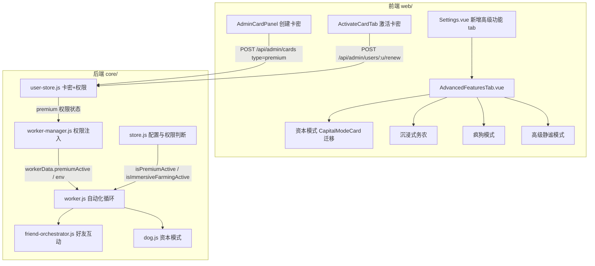

# 高级功能（高级权限体系 + 高级静谧模式）

Feature Name: advanced-features
Updated: 2026-08-17

## Description

建立统一的"高级功能"权限体系与配置入口。新增"高级功能"卡密类型（复用极速务农卡的时长/永久叠加模型），普通用户激活后获得高级功能权限；管理员/超级管理员永久有效。将资本模式、沉浸式务农、疯狗模式从原位置（首页"宠物"、策略设置、自动控制）收敛到设置页面的"高级功能"分组，并新增"高级静谧模式"（不偷不帮 / 只不偷菜 / 只不帮忙，支持多个时间段）。未激活权限时，前端置灰禁用并展示激活引导，后端自动化执行拦截。

## Architecture



## Components and Interfaces

### 1. 卡密与权限（`core/src/models/user-store.js`）

- 卡密类型扩展：`type` 取值 `time` / `quota` / `premium`（`turbo` 保留兼容但已停用创建）。
- `createCard` / `createCardsBatch`：支持 `premium` 类型，`premium` 卡按时间卡逻辑写入时长（复用 `assignDurationFields`）。
- `renewUser(username, cardCode)`：新增 `premium` 分支，激活/叠加 `user.premium`（复用现有 `turbo` 的叠加算法，含永久卡、已永久跳过、到期时间续叠）。
- `registerUser`：注册仅接受 `time` 卡，`premium` 卡注册时返回提示"高级功能卡请在登录后于续费/激活中使用"。
- `getUserPremiumStatus(username)`：返回 `{ active, expiresAt, isPermanent }`；`admin`/`super_admin` 恒为 `{ active: true, isPermanent: true }`。
- `getAllUsers` / `updateUser` / `editUser` 返回值补 `premium` 字段。
- `normalizeCardForResponse`：`premium` 卡按时间卡补充时长字段（非 quota 分支）。

### 2. 卡密接口（`core/src/controllers/admin-card-routes.js`）

- `POST /api/admin/cards`：`cardType` 映射改为 `quota`/`premium`/`time`；`type === "premium"` 走时长卡校验分支，删除对 `turbo` 的"已取消"拦截。

### 3. 权限注入（`core/src/runtime/worker-manager.js`）

- `createThreadWorker(account)`：`workerData` 增加 `premiumActive`（由 `account.username` 查询 `getUserPremiumStatus`）。
- `createForkWorker(account)`：`env` 增加 `FARM_PREMIUM_ACTIVE`（`'1'`/`'0'`）。
- 新增 `broadcastPremiumStatus()`：用户激活/续费高级功能卡密后，向受影响账号的 worker 推送最新 `premiumActive`，worker 侧更新内存标志，避免重启。

### 4. 权限判断（`core/src/models/store.js`）

- 新增 `getPremiumActive()`：优先读取 worker 注入的运行时标志（`process.env.FARM_PREMIUM_ACTIVE` 或 `workerData.premiumActive`），返回布尔值。
- `isImmersiveFarmingActive()`：开头加 `if (!getPremiumActive()) return false;`（无权限时沉浸式务农不生效）。
- 新增 `getAdvancedQuietMode()` / `getActiveAdvancedQuietMode(now)`：读取高级静谧模式多时段配置，返回当前命中的时段模式（未命中返回 `null`）。

### 5. 自动化执行拦截

- `core/src/services/dog.js`：`checkCapitalModeOnFarm` 与 `deployCapitalDog`/`recallCapitalDog` 入口校验 `getPremiumActive()`，无权限直接跳过并记日志。
- `core/src/services/friend-orchestrator.js` `checkFriends`：
  - `turboModeEnabled` 计算叠加 `getPremiumActive()` 校验，无权限视为关闭。
  - 计算 `doHelp`/`doSteal` 时叠加高级静谧模式：若 `getActiveAdvancedQuietMode(now)` 命中，按模式调整 `doHelp`/`doSteal`（`doBad` 不受影响）。
- 高级静谧模式语义：
  - `no_steal_no_help`（不偷不帮）：`doSteal=false`、`doHelp=false`。
  - `no_steal`（只不偷菜）：`doSteal=false`、`doHelp` 保持原值。
  - `no_help`（只不帮忙）：`doHelp=false`、`doSteal` 保持原值。

### 6. 前端设置页（`web/src/views/Settings.vue` 与新增组件）

- `Settings.vue`：`SettingsTabKey` 增加 `'advanced'`，tabs 增加 `{ key: 'advanced', label: '高级功能', icon: ... }`；渲染 `AdvancedFeaturesTab.vue`。
- 新增 `web/src/components/settings/AdvancedFeaturesTab.vue`：
  - 包含四个子区：资本模式、沉浸式务农、疯狗模式、高级静谧模式。
  - 未激活高级功能权限时，整体置灰（`opacity` + `disabled`）并展示"激活高级功能"引导。
  - 高级静谧模式：支持增删多个时间段，每项含模式选择（不偷不帮/只不偷菜/只不帮忙）+ 起止时间。
- `web/src/components/CapitalModeCard.vue`：整体迁入 `AdvancedFeaturesTab.vue`（可内嵌或作为子组件复用）。
- `web/src/components/settings/StrategyTimingPanel.vue`：移除沉浸式务农（`immersiveFarming`）区块。
- `web/src/components/settings/AutomationSettingsTab.vue`：移除疯狗模式（`friend_turbo_mode`）区块。
- `web/src/views/Dashboard.vue`：首页"宠物" tab 移除 `CapitalModeCard`（保留 `DogGiftsPanel`）。
- `web/src/stores/user.ts`：新增 `premium` 字段、`hasPremiumPermission`、`premiumExpireTimeText`；`Card.type` 联合类型加 `'premium'`；`formatCardValue` 支持 premium 文案。
- `web/src/components/settings/ActivateCardTab.vue`：激活成功后展示高级功能权限到期/永久状态。

## Data Models

### 卡密（`data/cards.json`）

```json
{ "code": "XXXX", "description": "高级功能月卡", "type": "premium",
  "enabled": true, "claimable": false, "usedBy": null, "usedAt": null,
  "days": 30, "durationValue": 30, "durationUnit": "day",
  "durationMs": 2592000000, "isPermanent": false, "createdAt": 0 }
```

### 用户（`data/users.json`）

```json
{ "username": "xxx", "role": "user", "card": {...},
  "premium": { "code": "XXXX", "description": "高级功能月卡", "enabled": true,
    "days": 30, "durationValue": 30, "durationUnit": "day",
    "durationMs": 2592000000, "isPermanent": false, "expiresAt": 1789584000000 },
  "accountLimit": 2, "turbo": null }
```

### 高级静谧模式（账号配置，`store.js`）

```js
premiumQuietMode: {
  enabled: false,
  slots: [
    { id: "s1", mode: "no_steal_no_help", start: "22:00", end: "06:00" },
    { id: "s2", mode: "no_steal", start: "12:00", end: "13:00" }
  ]
}
```

`mode` 枚举：`no_steal_no_help` | `no_steal` | `no_help`。时段判定复用 `parseTimeToMinutes`，支持跨午夜（`start >= end` 时跨天）。

## Correctness Properties

- 权限判定一致性：前端 `hasPremiumPermission` 与后端 `getUserPremiumStatus` 使用相同规则（管理员/超管永久、普通用户看 `expiresAt` 与 `isPermanent`）。
- 后端兜底：即使前端被绕过，自动化执行侧仍以 `getPremiumActive()` 拦截，未激活时高级功能一律不生效。
- 静谧模式与捣乱隔离：高级静谧模式仅调整 `doHelp`/`doSteal`，`doBad`（捣乱）保持独立，不受影响。
- 跨午夜时段：`start === end` 视为全天；`start < end` 为同日区间；`start > end` 为跨午夜区间，判定与 `inFriendQuietHours` 一致。
- 权限动态生效：激活高级功能卡密后通过 `broadcastPremiumStatus` 更新 worker，无需重启账号。

## Error Handling

- 卡密不存在/已禁用/已使用：沿用现有 `renewUser` 错误文案，前端 `showAlert` 展示。
- 注册使用 premium 卡：返回"高级功能卡请在登录后于续费/激活中使用"。
- 无权限执行高级功能：后端静默跳过并写入低等级日志，不向用户报错（避免刷屏）。

## Test Strategy

1. 单元：`getUserPremiumStatus` 在 admin/user/永久/到期四种场景下的返回值。
2. 单元：高级静谧模式时段判定（同日、跨午夜、全天、多时段命中优先级）。
3. 集成：`renewUser` 激活 premium 卡 → `user.premium` 字段与叠加逻辑；`registerUser` 拒绝 premium 卡。
4. 端到端（开发环境账号 1）：
   - 未激活时，`isImmersiveFarmingActive()` 返回 false、`checkFriends` 关闭疯狗模式、资本模式跳过。
   - 激活 premium 卡后，上述能力恢复；设置页"高级功能"分组解除置灰。
   - 高级静谧模式在命中的时段内按模式调整偷菜/帮忙，捣乱不受影响。
5. 前端：`pnpm build:web` 通过；未激活状态下高级功能分组置灰且不可编辑。

## References

[^1]: `core/src/models/user-store.js` - 卡密系统与用户权限（`createCard`、`renewUser`、`getUserTurboStatus`）。
[^2]: `core/src/controllers/admin-card-routes.js` - 卡密创建/批量创建接口。
[^3]: `core/src/runtime/worker-manager.js` - Worker 创建与权限注入点（`createThreadWorker`/`createForkWorker`）。
[^4]: `core/src/models/store.js` - 自动化配置与 `isImmersiveFarmingActive`。
[^5]: `core/src/services/friend-orchestrator.js` - 好友互动 `checkFriends`（doHelp/doSteal/doBad 计算）。
[^6]: `core/src/services/friend-api.js` - `parseTimeToMinutes` / `inFriendQuietHours` 时段判定。
[^7]: `core/src/services/dog.js` - 资本模式放狗/召回。
[^8]: `web/src/views/Settings.vue` - 设置页 tab 结构。
[^9]: `web/src/components/settings/StrategyTimingPanel.vue` - 沉浸式务农 UI。
[^10]: `web/src/components/settings/AutomationSettingsTab.vue` - 疯狗模式 UI。
[^11]: `web/src/stores/user.ts` - 前端用户权限模型。
